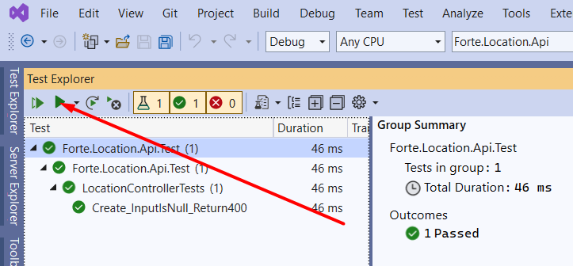

# Unit testing - controller
In this session, you will implement some API methods in the empty class in the **LocationController.cs** file. We will try to follow the pattern of TDD - Test Driven Development. Hence, you will write the unit tests at the same time (preferrably before) you extend the API with more and more functionality. 

The main data entity in this API are *locations*. A location has a name, in addition to coordinates, defined by longitude and latitude.

It should be possible to get locations, add new locations, delete locations and update already saved locations. These actions are called CRUD (Create, Read, Update, Delete) operations. 

## Create the test project
We're going to create a controller to manage the locations. 

<!-- The `LocationM` data class in the **Forte.Location.Services.Models** folder has the basic structure of a location. -->

Create a new test project for the `Forte.Location.Api` project called `Forte.Location.Api.Tests`.  See [Setup for Unit tests](01a-setup-unit-tests.md) if you need to review how to do it.

In the new project, create a file called `LocationControllerTests.cs`. Here we will implement the tests for the `LocationController` class.

The `LocationController` class uses the `LocationService` class, so we will also need to mock that (since we want to isolate `LocationController` to be the only SUT (System Under Test)). Create two fields `_controller` and `_locationServiceMock`, and initialize them in a `[TestInitialize]` method like this:

```cs
[TestClass]
public class LocationControllerTests
{
    private LocationController _controller;
    private Mock<ILocationService> _locationServiceMock;

    [TestInitialize]
    public void Initialize()
    {
        // Arrange
        _locationServiceMock = new Mock<ILocationService>();
        _controller = new LocationController(_locationServiceMock.Object);
    }
}
```

Visual Studio will probably complain about a few things, amongst others the `LocationController` constructor not being compatible. We will fix this in a few steps, so just leave it for the moment. Try to fix the other issues yourself.

The controller layer will manage the locations. The location model (`LocationM` class) is already created, and can be found in the **Forte.Location.Services** project. Open it to see the data model of a location. 


## Functionality - Create location

### Create a test case for the CreateLocation operation

Lets create our first actual test case!

Lets say we want to verify that the endpoint returns `400 Bad Request` if a parameter with value `null` is sent to the CreateLocation (`POST /locations`) operation. This can be verified with a test method like this:

```cs
private Mock<ILocationService> _locationServiceMock;

[TestInitialize]
public void Initialize()
{
    _locationServiceMock = new Mock<ILocationService>();
    _controller = new LocationController(_locationServiceMock.Object);
}

...
[TestMethod]
public async Task Create_InputIsNull_Return400()
{
    //Act
    var result = await _controller.Post(null);

    //Assert
    Assert.IsInstanceOfType(result, typeof(BadRequestResult));
}
```

Now we have a test case with a clearly defined expected input (`null`) and output (an instance of the `BadRequestResult` class) of the controller method called `Post`.

At the moment, this test should not pass. It shouldn't even find a method called `Post`. Great! Now, in the spirit of TDD, we need to implement code in the controller to make the test pass.

In the `LocationController` class, create a read-only field of type `ILocationService` called `_locationService`. Then create the constructor which initializes the field, like this:
```cs
public LocationController(ILocationService locationService)
{
    _locationService = locationService;
}
```

Next, create a method right underneath the constructor that obeys the input/output expectations set in the test we just created:
```cs

[HttpPost("locations")]
public async Task<IActionResult> Post([FromBody] LocationM location)
{
    if (location == null)
    {
        return BadRequest();
    }
    return Ok();
}
```

Visual Studio will probably give a warning about the `Post` method not running asynchronously at the moment. We will fix this later.

### Running tests
Now that we have created our first test, let's run it!

To open up the **Test Explorer** view, click **View > Test Explorer** in Visual Studio. In the top left corner of the **Test Explorer** view, click the green triangle to run all tests.



Hopefully, the test is passing!

### Extend the Create operation
Currently, the Create operation (represented by the method `Post`) does not do much. We want to be able to pass a location as a parameter, and it should be added correctly to the database, and the controller should return OK. But before we add this logic, we write a test.
As we now will be using the service layer, we must remember to include the setup of the mock!

```cs
[TestMethod]
public async Task Create_CorrectInput_ReturnOk()
{
    //Arrange 
    _locationServiceMock.Setup(mr => mr.AddLocation(It.IsAny<LocationM>())).Returns(Task.FromResult(true));

    LocationM location = new LocationM();
            
    //Act
    var result = await _controller.Post(location);

    //Assert
    Assert.IsInstanceOfType(result, typeof(OkObjectResult));
}
```

Try running the test suite again - it should fail. To make it pass, we need to refactor (update) the `Post` method. Add a call to the `AddLocation()` method, and a message text to output if that the location was successfully added:
```cs
[HttpPost("locations")]
public async Task<IActionResult> Post([FromBody] LocationM location)
{
    if (location == null)
    {
        return BadRequest();
    }
    await _locationService.AddLocation(location);
    return Ok(new { message = "Location added" });
}
```

Try running the tests again.

### Verify internal server error is returned when failing

Let's also verify that the endpoint returns `500 Internal Server Error` if something goes wrong (the `AddLocation` method returns `false`).

This time, try writing the test method on your own. If you're stuck, the solution can be found in the save points.

As before, the test should initially fail. Try refactoring the controller method to check the response from `AddLocation()` and make the test pass.

## Functionality - Read (get) locations
Next, we will create the methods for the **GET /locations** endpoint in the `LocationController` class. The endpoint will simply return the response from the service layer.

Start by creating a test method which prepares the `LocationService` mock by giving it a return value of `List<LocationM>` and one or more mocked `LocationM` objects.

Then implement a method that will make the test pass.

## Create the rest of the CRUD operations
Now we have created tests and implementations for the `Create` and `Read` operations. The rest of the operations (`Update` and `Delete`) follow the same pattern. Add the remaining two implementations to the `LocationController` and write tests for both of them. There should be at least two tests for delete and three for update.

**Great! You have completed the "Unit testing - controller" section.**
**Next up - [Unit testing of the service layer](01c-unit-testing-service.md)**
