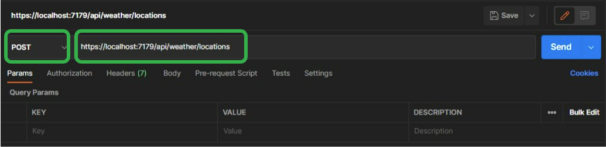
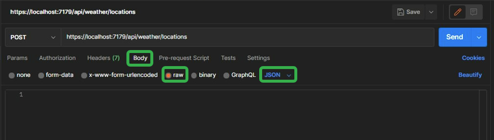
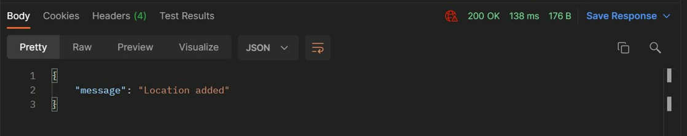
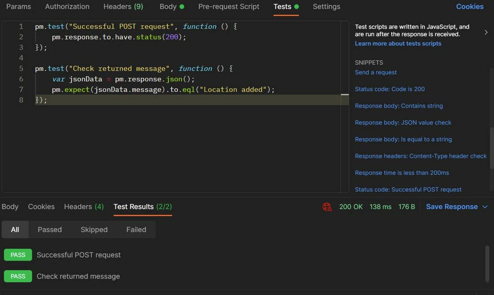
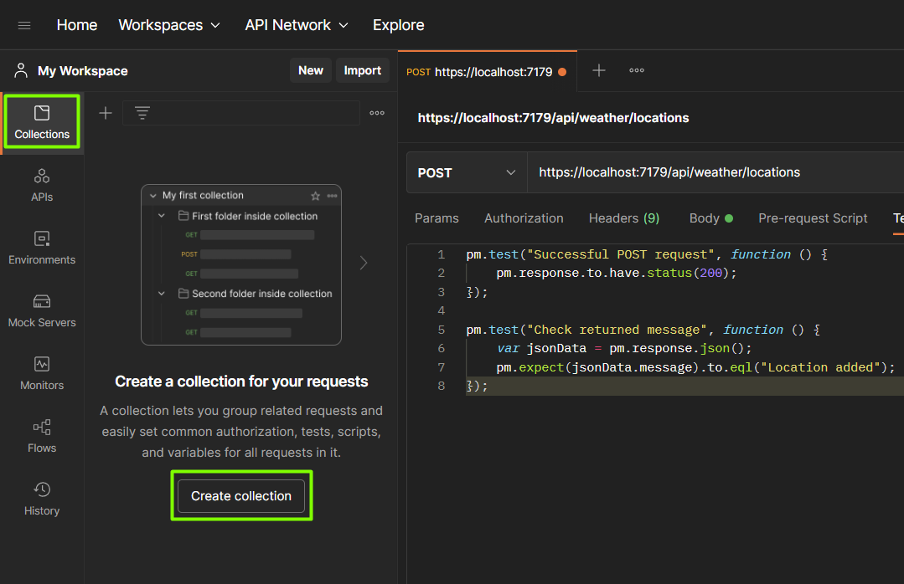

# Setup for system integration testing

This section will go trough the installation of Postman and show the basics of how the tool works using one of our endpoints. 

## Download Postman
Download Postman from https://www.postman.com/downloads/, and click through the installation wizard.

Upon opening Postman for the first time you will be asked to create an account. This step is not necessary, but with an account all your work will be stored in the cloud for easy access on other devices. You will also have the option to create workspaces, for instance one workspace for each application/project, which is quite handy. An account also enables you to collaborate with others.
If you work with an API that handles sensitive information the cloud-sync might be something you want to avoid but for our Forte Location API this is not a problem, so we recommend creating a free account. 

## Example of use
We will use the POST method of */weather/locations* to show the basics of how Postman works. 

Click **New > HTTP Request**. 

Paste the URL of the endpoint. By default, the URL should be https://localhost:7179/api/weather/locations.

Change the HTTP method to POST. 



Go to the **Body** tab, select **raw** and switch the content type to **JSON**.



Paste the following JSON data in the text-field:

```json
{
    "name": "Postman-Post-Test",
    "latitude": 11,
    "longitude": 22
}
```

Make sure your API is up and running and click **Send**. You might get a popup from Postman asking to disable SSL. If that is the case, disable it.

In the response window at the bottom of the screen you will see if the request was successful or not, the response body and other metrics. It should look something like this:



Now switch over to the **Tests** tab. Here we can write tests in JavaScript code that will be executed after the request is sent. We can use this to check if the response is what we expect it to be. You can use the example snippets as inspiration for different checks. For this request we add one test to verify the status code, and one to check the returned body text. 

```javascript
pm.test("Successful POST request", function () {
    pm.response.to.have.status(200); 
});

pm.test("Check returned message", function () {
    var jsonData = pm.response.json();
    pm.expect(jsonData.message).to.eql("Location added");
});
```
Pressing **Send** again now will show the test results on the bottom.



Let's use this request as a starting point for a new Postman collection. Create a new collection and give it a descriptive name, for instance **Forte.Location.Api**.



To save our request to this collection, click the **Save** button with the floppy disk in the top right corner, then choose the newly created collection and then hit the **Save** button.


### Variables
A handy tips in Postman is to use variables. This will make changing values easier and improve readability. 
Variables can be defined in different scopes: **Global**, **Environment**, **Collection**, **Data** and **Local**. 

You can read more about this on https://learning.postman.com/docs/sending-requests/variables/.

An example is to use collection variables for the values of the location you are adding. This way you can use the variables in other requests as well, like when you verify that the location has been added. 

Next up - [Tasks for system integration testing](03b-tasks-system-integration-testing.md)